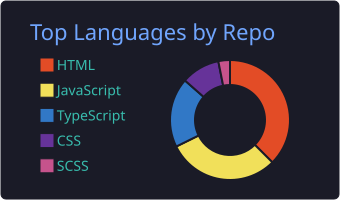
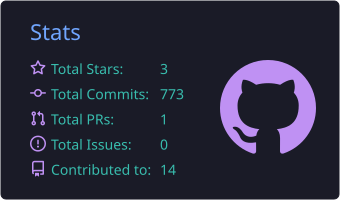
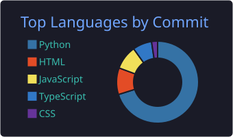
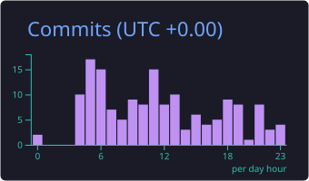

<!--
HOW TO USE THIS FILE:
1. Create (or open) the special repo named EXACTLY your username: github.com/dev-Anamul/dev-Anamul
2. Add a file named README.md at the repo root, on the DEFAULT branch (main).
   NOTE: your current repo returned 404 for README.md on main — likely no README committed,
   or it's on a non-default branch. Commit this as README.md on `main` and it will render on your profile.
3. Paste everything BELOW this comment block. Replace every [BRACKET] placeholder.
4. Commit. Refresh your profile — it renders at the top.
-->

<h1 align="center">Hi, I'm Md. Anamul Haque 👋</h1>

  <b>Backend Software Engineer</b> · NestJS · Node.js · TypeScript 
  I build event-driven, distributed backends — payments, multi-tenant SaaS, real-time systems. 
  <i>Open to full-time remote roles (4+ hrs US/EU overlap).</i>

  
  

---

### 🚀 About me

Backend engineer with **3+ years of production experience** building scalable server-side systems. I care about **reliability, clean architecture, and systems that fail gracefully**. Day to day I work with NestJS, Node.js, PostgreSQL, MongoDB, Redis, and message queues — and I've shipped things like idempotent payment webhooks, transactional-outbox event delivery, and multi-tenant data isolation.

- 🔭 Currently building an open-source **event-driven order & payments backend** (see pinned repos)
- 🌱 Deepening: Kubernetes, AWS (SA-Associate), system design at scale
- 🧩 Favorite problems: distributed consistency, idempotency, caching & invalidation
- 💬 Ask me about: NestJS, event-driven architecture, payments/Stripe, the outbox pattern
- 📫 Reach me: **haque.anamul.dev@gmail.com** · open to remote backend roles

---

### 🛠️ Tech Stack

**Languages & Runtime**

**Frameworks**

**Databases & Cache**

**Messaging & Infra**

**Architecture:** REST APIs · CQRS · Event-Driven · Clean/Hexagonal · Microservices · WebSockets · Transactional Outbox

---

### 📌 Featured Projects

> Pin these repos on your profile (Customize your pins → select these). Replace links/descriptions.

| Project                                                               | What it demonstrates                                                              | Stack                                |
| --------------------------------------------------------------------- | --------------------------------------------------------------------------------- | ------------------------------------ |
| **[event-driven-payments](https://github.com/dev-Anamul/[REPO])**     | Transactional outbox, idempotent Stripe webhooks, DLQ + replay, Redis cache-aside | NestJS · PostgreSQL · Redis · BullMQ |
| **[multi-tenant-saas-starter](https://github.com/dev-Anamul/[REPO])** | Postgres Row-Level Security, per-request tenant context, JWT rotation, RBAC       | NestJS · PostgreSQL · Drizzle        |
| **[project 3]](https://github.com/dev-Anamul/[REPO])**                | [one-line value]                                                                  | [stack]                              |

---

### 📊 GitHub Stats

<!--
  These are STATIC SVGs committed INTO this repo (not live calls to a flaky external
  service), so they can NEVER show a broken image / 503 to a recruiter.

  They are generated + refreshed daily by the GitHub Action in:
  .github/workflows/profile-summary-cards.yml  (setup instructions are in that file)

  After the Action runs once, these files exist and the images below will render.
  If you use a theme other than "tokyonight", change the folder name in the paths.
-->

  
  

  
  

<!-- Streak card: a static snapshot is available at ./assets/streak.svg (copy it in from
     interview-prep-guide/assets/github-cards/streak.svg). Or, for a live-updating version,
     use the maintained demolab host (reliable, unlike the old heroku one):

  

-->

> Note: only add the stats section once you're committing regularly (e.g. to the flagship
> project). If your activity is still thin, a clean profile without stats looks stronger than
> stats that reveal a quiet graph — your positioning, badges, and pinned projects carry it.

---

<i>Building reliable backends, one event at a time. Let's connect.</i>

